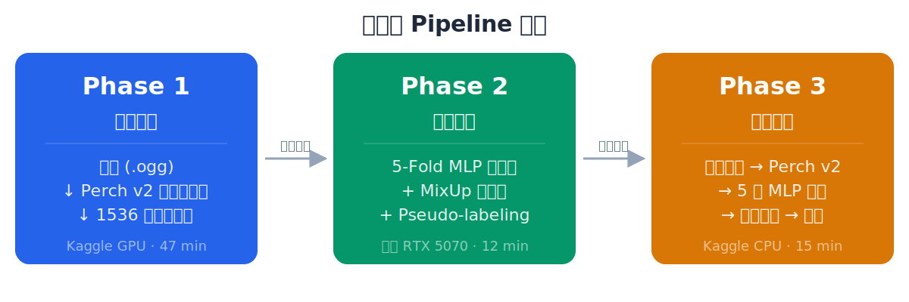
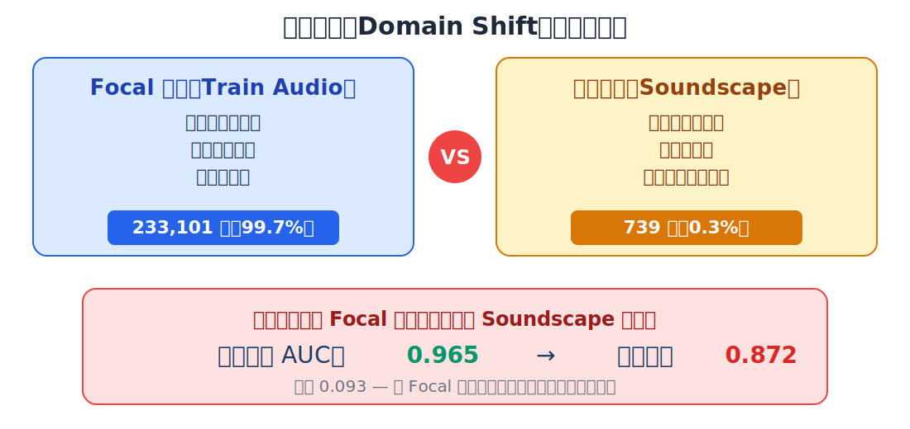
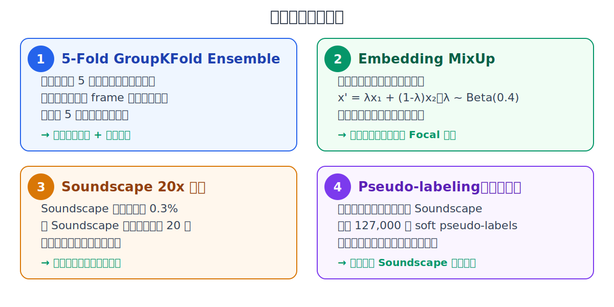
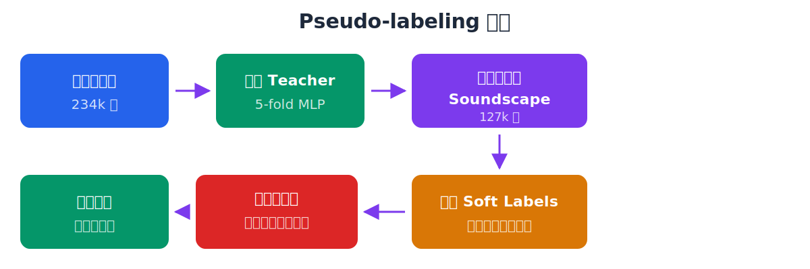
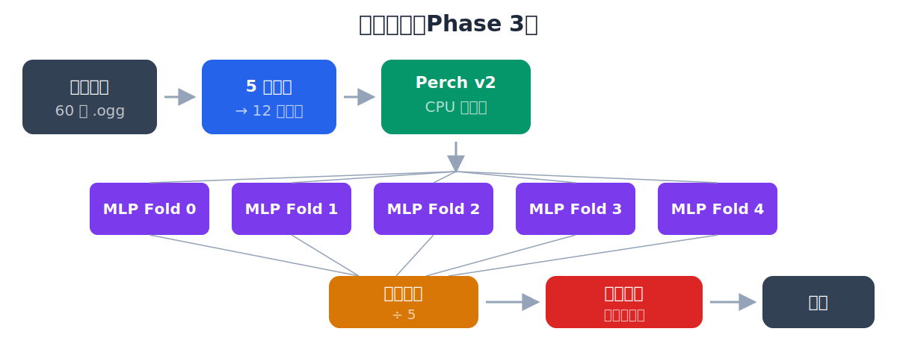
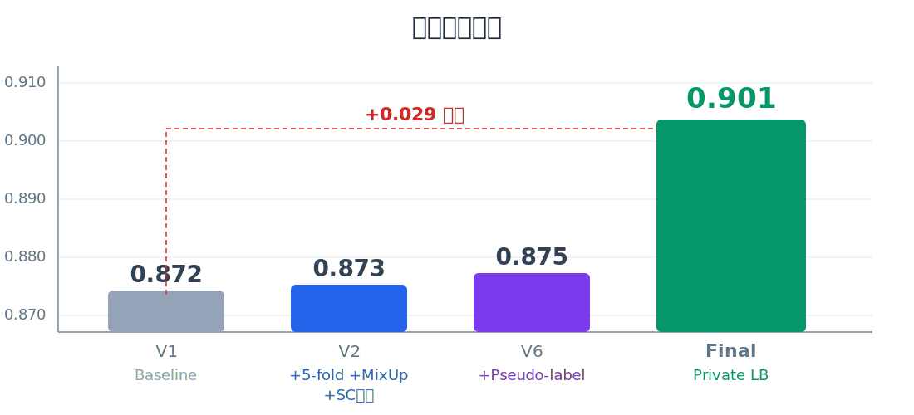

# BirdCLEF+ 2026 — 期末專題報告

**題目：** 凍結預訓練編碼器 + 可訓練分類頭在 Pantanal 濕地多物種聲音辨識的應用

**成績：** Private Leaderboard macro ROC-AUC = **0.90112**，排名 2621

---

## 1. 任務簡介

從巴西 Pantanal 濕地的連續錄音中，每 5 秒辨識出現的物種。共 **234 種**（鳥類、兩棲、昆蟲、哺乳、爬蟲），評估指標為 **macro-averaged ROC-AUC**。提交限制：Kaggle CPU、90 分鐘、無網路。

## 2. 整體架構

**核心思路：** 利用 Google Perch v2 預訓練模型作為凍結特徵提取器，將音訊轉為 1536 維嵌入向量，再訓練輕量 MLP 分類頭（~1.57M 參數）。三階段分開執行，因為 Perch v2 需要 TensorFlow 2.20，無法在本地 Windows + RTX 5070 環境運行。

## 3. 核心問題：Domain Shift

訓練資料以 Focal 錄音（近距離、低噪音）為主，但測試集是 Soundscape（野地錄音、高噪音、多物種重疊）。訓練集中 Soundscape 僅佔 **0.3%**，導致模型嚴重偏向 Focal 領域，本地驗證 AUC 高達 0.965，但排行榜僅 0.872。

**所有後續優化都圍繞這個問題展開。**

## 4. 四大優化策略

## 5. Pseudo-labeling 流程

利用已訓練的 5-fold Teacher 模型，對 **127,000 筆未標記 Soundscape** 生成 soft pseudo-labels，加入訓練集（嚴格不進驗證集），讓模型接觸大量野地場景嵌入，直接緩解 domain shift。

## 6. 推論流程

推論時 5 個 MLP 分類頭各自預測後取平均，再對同一檔案內的相鄰時間段做時序平滑（temporal smoothing），進一步降低預測噪音。

## 7. 迭代改進歷程

| 版本 | LB Score | 新增優化 |
|---|---|---|
| V1 | 0.872 | Baseline 單模型 |
| V2 | 0.873 | +5-fold ensemble, +MixUp, +SC 20x 加權 |
| V6 | 0.875 | +Pseudo-labeling (127k 筆) |
| **Final** | **0.901** | **Private LB 最終成績** |

## 8. 結論

1. **Domain shift 是最大瓶頸**：訓練與測試資料分布差異遠比模型架構選擇重要
2. **凍結編碼器 + 輕量頭是可行的**：Perch v2 的通用音訊表示足以支撐 234 物種分類，訓練僅需 12 分鐘
3. **Pseudo-labeling 有效但有天花板**：Teacher 本身在 Soundscape 上的弱點會傳遞給 pseudo-labels
4. **Ensemble 穩定提升**：5-fold 平均 + 時序平滑提供低成本的可靠增益
